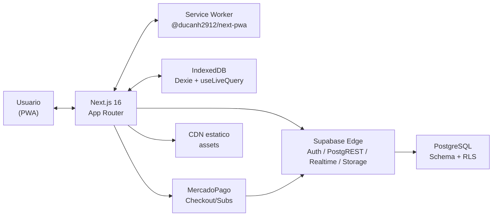
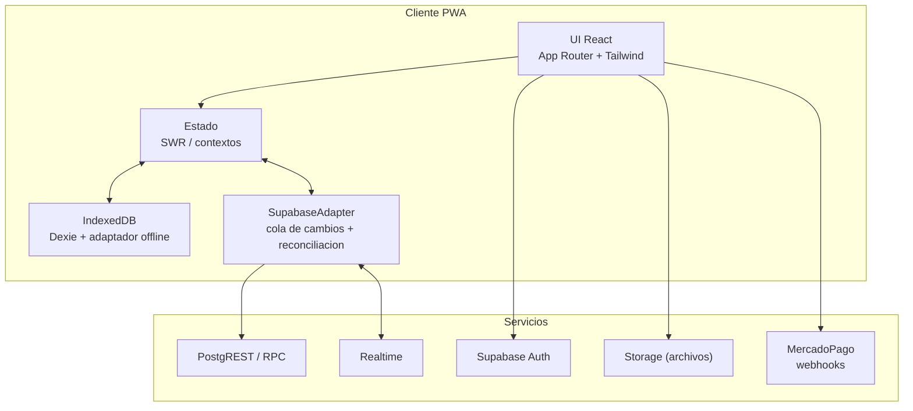

# Diagramas de Componentes (Flowcharts)

Proposito: mapa estable del sistema. Actualizar solo si cambia topologia (agregar/quitar servicios) o se mueve la frontera cliente/servidor.

## Contexto (alto nivel)

## Componentes principales (cliente + backend)

## Notas

- La PWA opera offline con Dexie; Sync reintenta cuando vuelve la conexion.
- MercadoPago solo se conecta en flujos de checkout; webhooks actualizan estado de suscripcion.
- Realtime alimenta la UI solo en conectividad; offline sigue leyendo Dexie.
