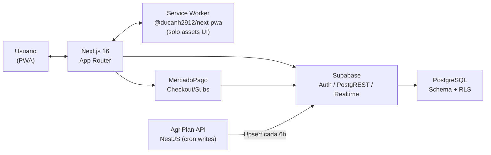
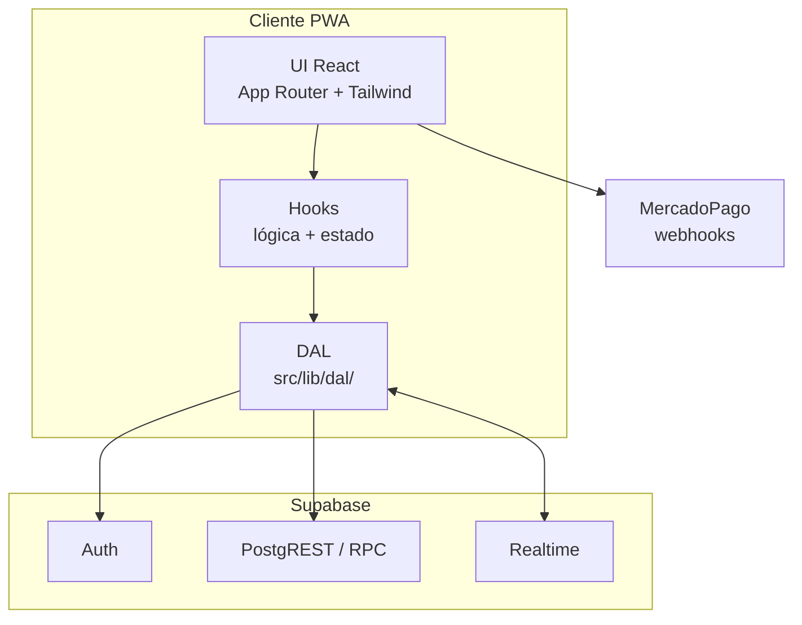

# Diagramas de Componentes (Flowcharts)

Proposito: mapa estable del sistema. Actualizar solo si cambia topologia (agregar/quitar servicios) o se mueve la frontera cliente/servidor.

## Contexto (alto nivel)

```mermaid
flowchart LR
  U["Usuario\n(PWA)"]
  App["Next.js 16\nApp Router"]
  SW["Service Worker\n@ducanh2912/next-pwa\n(solo assets UI)"]
  Supa["Supabase\nAuth / PostgREST / Realtime"]
  PG["PostgreSQL\nSchema + RLS"]
  MP["MercadoPago\nCheckout/Subs"]
  API["AgriPlan API\nNestJS (cron writes)"]

  U <--> App
  App <--> SW
  App --> Supa
  Supa --> PG
  App --> MP
  MP --> Supa
  API -->|Upsert cada 6h| Supa
```

## Componentes principales (cliente + servicios)

```mermaid
flowchart TB
  subgraph Cliente PWA
    UI["UI React\nApp Router + Tailwind"]
    Hooks["Hooks\nlógica + estado"]
    DAL["DAL\nsrc/lib/dal/"]
  end

  subgraph Supabase
    Auth["Auth"]
    DB["PostgREST / RPC"]
    RT["Realtime"]
  end

  UI --> Hooks
  Hooks --> DAL
  DAL --> Auth
  DAL --> DB
  DAL <--> RT
  UI --> MP["MercadoPago\nwebhooks"]
```

## Notas

- Sin IndexedDB ni capa offline. Service Worker cachea solo assets estáticos (JS, CSS, imágenes).
- Toda lectura/escritura de datos pasa por DAL → Supabase directamente.
- AgriPlan API (NestJS) escribe en Supabase vía cron cada 6h. La PWA lee la misma tabla.
- MercadoPago solo se conecta en flujos de checkout; webhooks actualizan estado de suscripción.
