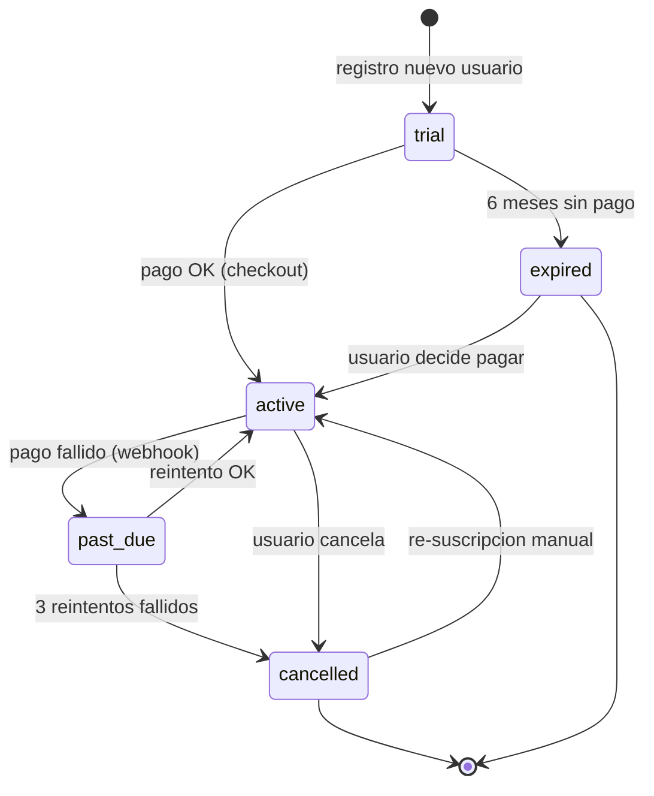
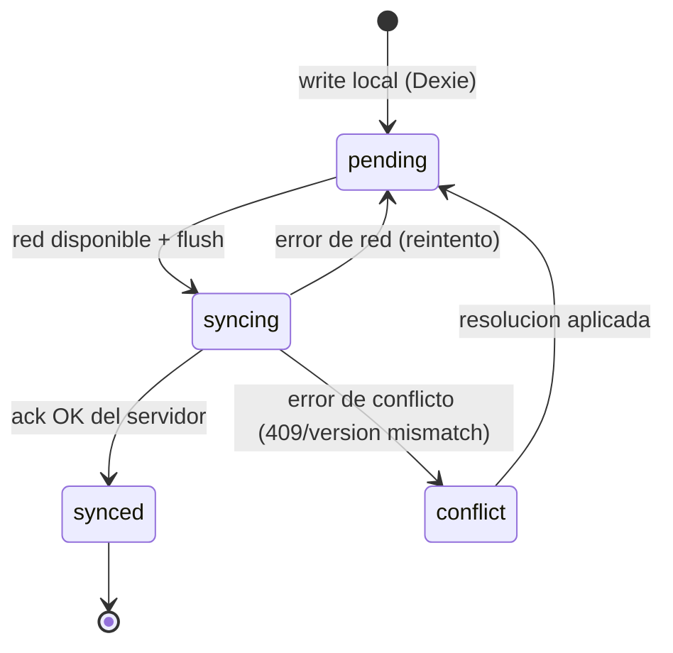

# Diagramas de Estados

Proposito: ciclos de vida de entidades clave con transiciones validas. Solo actualizar si cambian reglas de negocio.

## Estados de Suscripcion (MercadoPago)

## Estados de Sync Offline (cola Dexie → Supabase)

