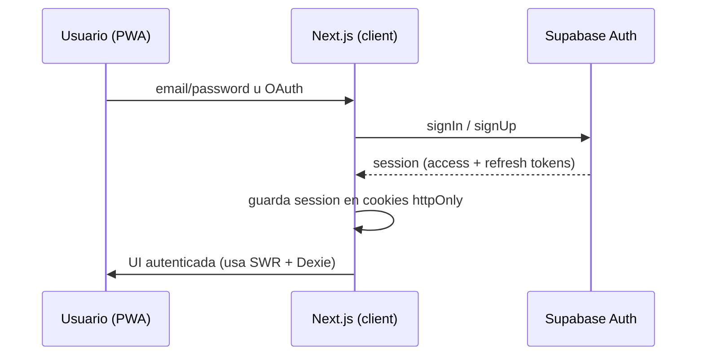
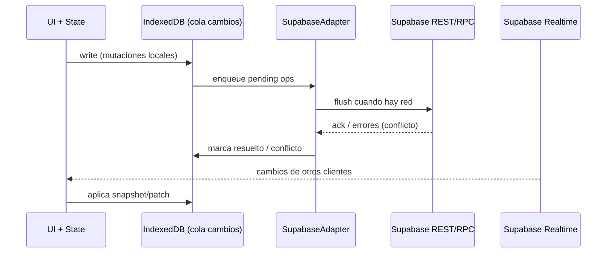
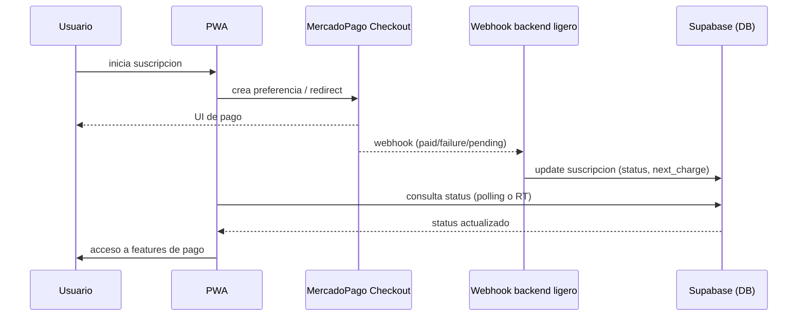

# Diagramas de Secuencia

Proposito: contratos criticos de interaccion entre actores. Solo actualizar si cambia el flujo de negocio, no por tweaks de UI.

## Login / Sesion Supabase

## Sync offline → online (Dexie ↔ Supabase)

## Checkout MercadoPago (suscripcion)

